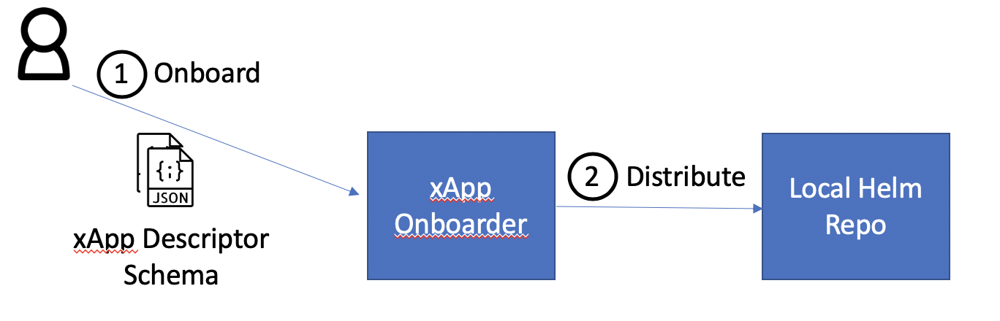

.. This work is licensed under a Creative Commons Attribution 4.0 International License.
.. http://creativecommons.org/licenses/by/4.0
..
.. Copyright (C) 2019 AT&T Intellectual Property

Project Overview
================

Introduction
------------

xApp onboarder provides the xapp onboarding service to operators. It consumes the xApp descriptor and optionally additional schema file, and produces xApp helm charts.
xApp onboarder also provides CLI tools for local testing and debuging. 

Change logs
-----------
+------------+--------------+-------------------------------------------------------------------------------------------------+
| Version    | Date         | Description                                                                                     |
+============+==============+=================================================================================================+
|1.0.0       | Mar 23 2020  | First release                                                                                   |
+------------+--------------+-------------------------------------------------------------------------------------------------+
|1.0.1       | May 13 2020  | **Bug fix:** add a work-around for backward compatibility. Now xapp onboarder writes the xApp   |
|            |              | descriptor and schema json files into xApp helm charts.                                         |
+------------+--------------+-------------------------------------------------------------------------------------------------+
|1.0.7       | Jun 15 2020  | **Bug fix:**                                                                                    |
|            |              | fix the xApp service name for appmgr backward compatibility.                                    |
|            |              | **Feture add:**                                                                                 |
|            |              | add RMR source name environment variable.                                                       |
|            |              | add lable for VESPAMGR to report xapp name.                                                     |
|            |              | add option to inject annotation.                                                                |
|            |              | add option to inject command parameters.                                                        |
+------------+--------------+-------------------------------------------------------------------------------------------------+

Configurations
--------------

xApp onboarder uses the following environment parameters to configurate its instance.

+----------------------+----------------------+-------------------------------------------------------------------------------------------------+
| Enviroment Variable  |   Default Value      | Description                                                                                     |
+======================+======================+=================================================================================================+
| CHART_WORKSPACE_PATH | /tmp/xapp_onboarder  | Temporary directory for xApp helm chart generation                                              |
+----------------------+----------------------+-------------------------------------------------------------------------------------------------+
| CHART_REPO_URL       | \http://0.0.0.0:8080 | URL for local helm repo that stores the onboarded xApp helm chart                               |
+----------------------+----------------------+-------------------------------------------------------------------------------------------------+
| HTTP_TIME_OUT        | 10                   | Timeout value for outgoing REST API calls                                                       |
+----------------------+----------------------+-------------------------------------------------------------------------------------------------+
| HELM_VERSION         | 2.12.3               | Version of the helm client                                                                      |
+----------------------+----------------------+-------------------------------------------------------------------------------------------------+
| HTTP_RETRY           | 3                    | Number of http retries for outgoing REST API calls                                              |
+----------------------+----------------------+-------------------------------------------------------------------------------------------------+
| ALLOW_REDEPLOY       | True                 | Whether to allow reusing version number when onboard xApps                                      |
+----------------------+----------------------+-------------------------------------------------------------------------------------------------+
| CHART_WORKSPACE_SIZE | 500 MB               | Size limit of the CHART_WORKSPACE_PATH temporary directory                                      |
+----------------------+----------------------+-------------------------------------------------------------------------------------------------+
| FLASK_PORT           | 8888                 | Port the xApp onboarder will listen to                                                          |
+----------------------+----------------------+-------------------------------------------------------------------------------------------------+
| FLASK_DEBUG          | True                 | Enable HTTP server debug messages                                                               |
+----------------------+----------------------+-------------------------------------------------------------------------------------------------+                 
